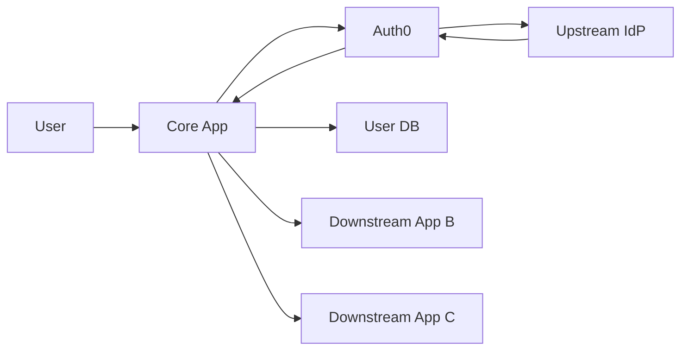
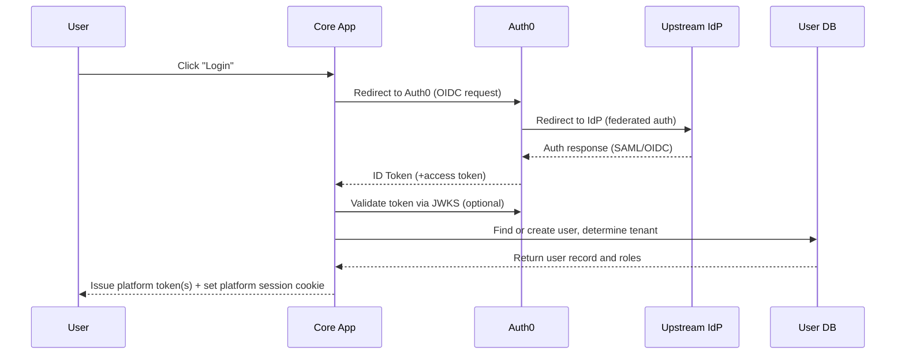
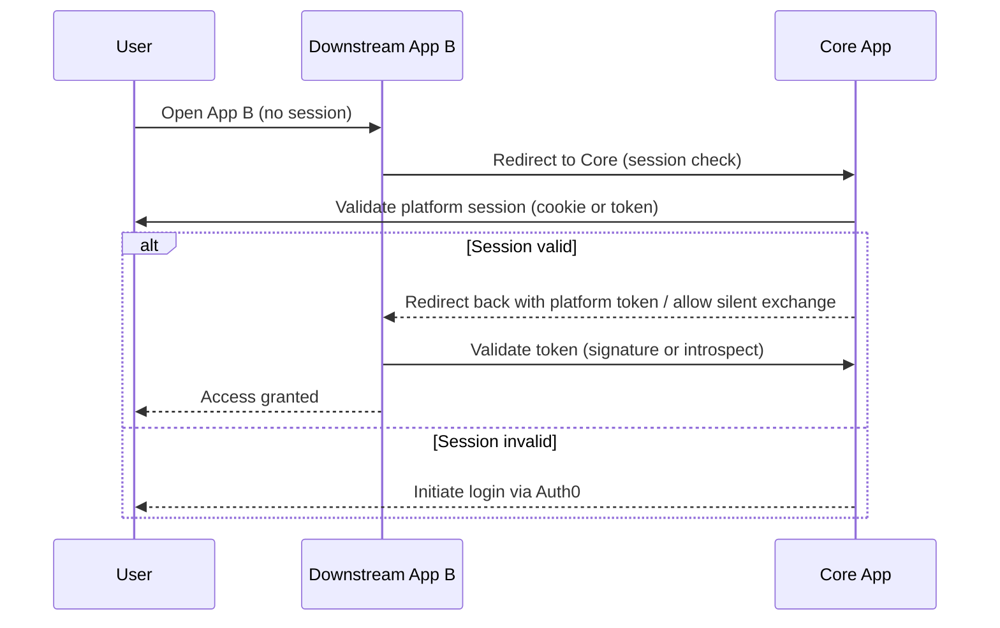
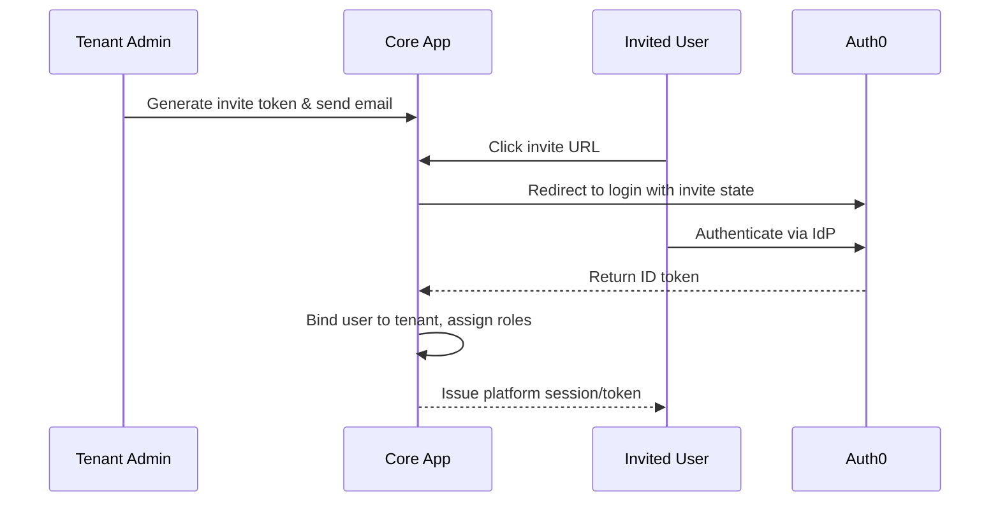

# Auth0 as Federated IdP — Core App SSO Architecture

## Summary

This document describes the recommended architecture where **Auth0 is the single federated login provider** for your application suite, starting with Entra ID as the upstream IdP and designed to support additional IdPs in the future. The **Core App provides SSO, tenant administration, and RBAC** for multiple internal applications.

---

## Components

* **Upstream IdPs**: Entra ID (Azure AD), Okta, Google Workspace — one active initially, others can be added later.
* **Auth0 (Single Tenant)**: Federated login, ID token issuance, optional MFA.
* **Core App (SSO Authority & Tenant Admin)**: Receives Auth0 tokens, creates platform sessions, manages tenants and roles, issues internal SSO tokens.
* **Downstream Apps**: Billing, Analytics, Admin, Electron/Desktop apps — trust Core App platform tokens.
* **User Database**: Stores tenant membership, roles, permissions, invite tokens.
* **Optional: Token Introspection / Central Session Store**: For real-time session revocation.

---

## System Diagram



---

## Login Flow



---

## SSO to Downstream Apps



---

## Platform Token Strategy

* **Platform ID Token**: Short-lived JWT with user identity, tenant_id, roles, apps.
* **Platform Access Token**: Bearer token for APIs.
* **Refresh Token**: Managed securely by Core App for long-lived sessions.

### Example JWT Payload

```json
{
  "iss": "https://core.myplatform.com",
  "sub": "auth0|123456",
  "tenant_id": "tenant_abc",
  "roles": ["billing_admin"],
  "apps": ["billing","analytics"],
  "iat": 1699990000,
  "exp": 1699993600,
  "aud": "internal_apps"
}
```

---

## Core App Endpoints

* `GET /oauth2/authorize` — Start Auth0 login
* `GET /oauth2/callback` — Receive Auth0 token
* `POST /oauth2/token` — Issue platform access token
* `GET /.well-known/jwks.json` — Public key for token validation
* `POST /introspect` — Token introspection (optional)
* `POST /revoke` — Revoke refresh tokens/sessions
* `GET /userinfo` — Fetch user info for downstream apps

---

## Invitation Flow



---

## Security & Best Practices

* Validate Auth0 tokens via JWKS
* Verify `aud` and `iss` claims
* Use RS256 for JWTs
* Rotate keys periodically
* Use HTTPS and secure token storage
* Implement refresh token rotation in Core App
* Rate-limit authentication endpoints

---

## Deployment Checklist

* Configure Auth0 tenant with Entra ID; plan for additional IdPs
* Implement Core App token endpoints & JWKS
* Design platform JWT payload & expiration
* Implement user DB with tenants & roles
* Implement invite token generation & verification
* Setup downstream apps to validate Core App JWKS
* Implement refresh token rotation & revocation
* Add monitoring & alerting for auth endpoints
