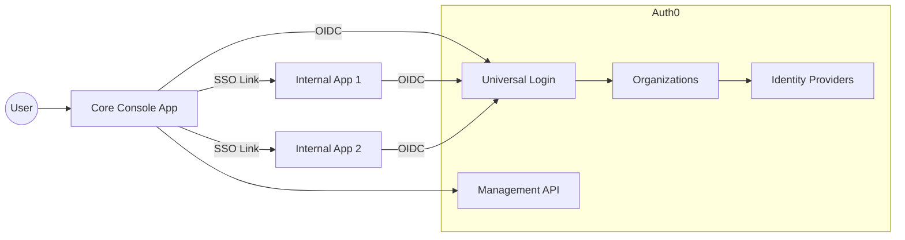
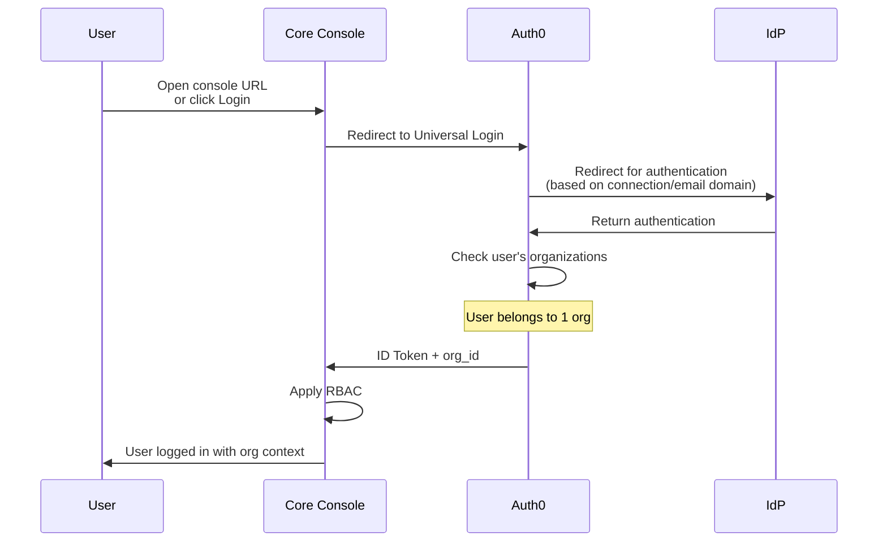
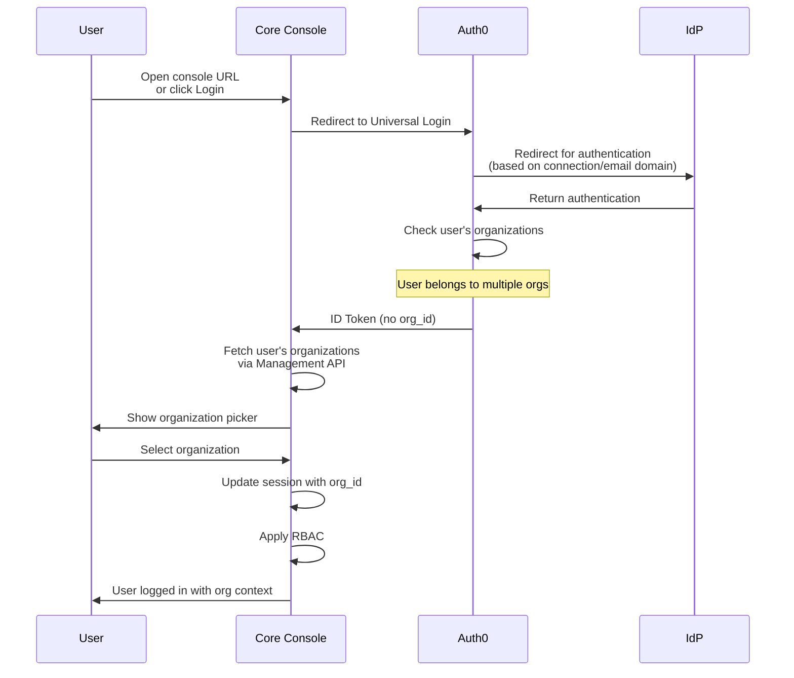
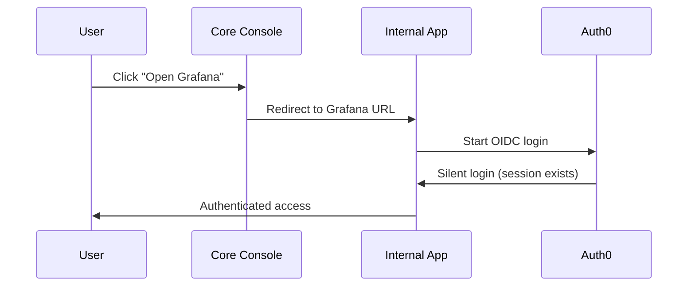
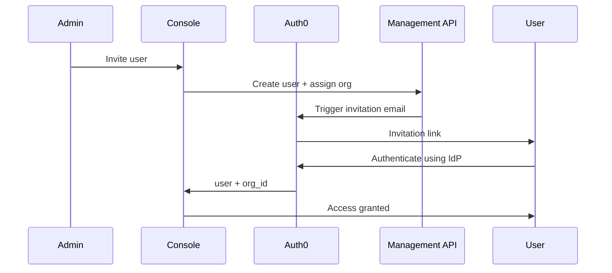

# Auth0 Multi‑Tenant Authentication & SSO Architecture Proposal

This document summarizes the requirements gathered from discussions and prior chat context, then presents a consolidated implementation approach, detailed steps, areas of concern, and Mermaid‑based flow diagrams.

---

# 1. Objectives

* Replace Cognito with **Auth0** for authentication across all internal and external applications.
* Use **Auth0 Organizations** to model customers/tenants.
* Provide **single federated login with auto‑routed IdP selection** (Entra ID, Okta, etc.).
* Provide **SSO** between the core console and internal applications.
* Core console owns **RBAC**; Auth0 owns authentication.
* Enable **user invitations**, external consultants, and multi‑org users.
* Allow external apps (Grafana, etc.) to authenticate **directly with Auth0**, not via the console.
* Support customer‑specific custom domains for internal apps (e.g., `gap-grafana.example.com`).
* Console remains a single multi-tenant application accessed via one URL.

---

# 2. High‑Level Architecture

* **Auth0 Tenant** (single production tenant)

  * Unlimited **Organizations** (each representing a customer)
  * Each Organization has one or more **connections** (IdPs)
  * User authenticates via connection, then organization membership is determined
  * Users can belong to multiple organizations

* **Core Console Application**

  * Single multi-tenant application (e.g., `console.example.com`)
  * Uses OIDC login via Auth0
  * Determines RBAC internally
  * Organization context determined by user's Auth0 org membership
  * Launchpad to internal apps

* **Internal Applications** (Grafana, etc.)

  * Org-specific instances with custom domains (e.g., `gap-grafana.example.com`)
  * Each instance is a direct OIDC client in Auth0
  * Have their own allowed callback URLs
  * Use Auth0 session for SSO

* **Identity Providers** (per Org)

  * Entra ID, Okta, Google Workspace
  * Configured at org level

---

# 3. Implementation Strategy Summary

## 3.1 Authentication

* Auth0 fully handles authentication.
* Universal Login used for all flows.
* User authenticates via their connection (IdP).
* Console app controls RBAC for organization authorization
* Customer application instances are controlled with Auth0 organization connections

## 3.2 Authorization / RBAC

* The core console owns RBAC and tenant resource access.
* Token contains `org_id` only; roles come from internal DB.
* Internal apps may use lightweight RBAC or rely on console provisioning.

## 3.3 SSO

* Auth0 session provides SSO across all apps.
* Core console redirects users into internal apps; internal apps perform silent OIDC login.

## 3.4 User Invitations

* Console calls the Auth0 Management API:

  * Create user
  * Assign to Organization
  * Trigger invitation email or "password reset" email

## 3.5 External Consultants (e.g., Logic, JumpMind)

* Invited into customer Organizations
* Can authenticate with their own IdP
* Access console at same URL; organization context determined by Auth0 membership
* When accessing org-specific internal apps, use customer-scoped URLs (e.g., `gap-grafana.example.com`)

## 3.6 Application Access & Reconciliation

* Console determines which internal apps a user should access
* Console updates Auth0 (via Management API) to assign or remove user access to specific OIDC clients
* External apps read Org + user membership from token

## 3.7 SCIM (Day 2)

* Enable SCIM to auto‑provision/deprovision users from customer IdPs.

---

# 4. Detailed Steps

## 4.1 Initial Setup

1. Create a single Auth0 production tenant
2. Configure custom domains for org-specific internal apps:

   * `gap-grafana.example.com`
   * `acme-grafana.example.com`
   * Note: Console app is multi-tenant and accessed via single URL (e.g., `console.example.com`)
3. Configure Universal Login (no custom hosting unless needed)

## 4.2 Organization Setup

1. For each customer:

   * Create Organization
   * Add email domains
   * Assign IdP(s)
2. Configure default connection(s) for each Organization
3. Configure login domain → org mapping

## 4.3 App Setup in Auth0

1. Create OIDC App: **Core Console**
2. Create OIDC App per internal application:

   * Grafana‑GAP
   * Grafana‑ACME
   * etc.
3. Enable Organization support on these apps
4. Configure allowed callbacks for each internal app

## 4.4 Login Flow Integration

1. Console redirects to Auth0 Universal Login
2. Auth0 infers Organization using either:

   * email domain
   * custom domain
3. Auth0 selects the correct IdP
4. Auth0 creates/updates session
5. Console reads ID token + Organization
6. Console applies RBAC

## 4.5 SSO to Internal Apps

1. Console redirects user to internal app URL
2. Internal app triggers OIDC login with Auth0
3. Auth0 session is active → silent redirect
4. Internal app receives ID token scoped to the Organization

## 4.6 User Invitation Flow

1. Console admin invites user
2. Console calls Auth0 Management API
3. Auth0 sends invitation email
4. User logs in via their IdP
5. Console assigns roles and app access

---

# 5. Key Areas of Concern

## 5.1 Multi-Organization User Handling

* Users can belong to multiple Organizations → need org selector UI after authentication
* Organization context must be maintained throughout session
* Must handle org switching if needed

## 5.2 Token Scoping and Tenant Isolation

* Internal apps must enforce `org_id`
* Prevent cross‑tenant access via token introspection

## 5.3 Management API Usage

* Must secure the endpoint used to invite users
* Rate limits apply

## 5.4 External Users

* When guest users are invited to an organization:

  * They authenticate using *their own* IdP
  * Must not be forced through customer IDP
  * Console access via standard URL with org context from Auth0
  * Internal app access via org-specific custom domains

## 5.5 SCIM

* Day‑two concern; adds complexity but solves lifecycle issues

## 5.6 Billing / Licensing

* Need to clarify B2B tier capabilities and cost

---

# 6. Mermaid Diagrams

## 6.1 High‑Level Architecture Diagram

## 6.2 Login Flow (Single Org User)

## 6.2b Login Flow (Multi-Org User)

## 6.3 SSO to Internal Apps

## 6.4 User Invitation Flow

---

# 7. Next Steps

1. Build a POC using a free Auth0 tenant
2. Model multiple orgs with different IdPs
3. Validate login, invitation, and SSO flows
4. Document findings for leadership
5. Engage Auth0 sales/architect for validation
