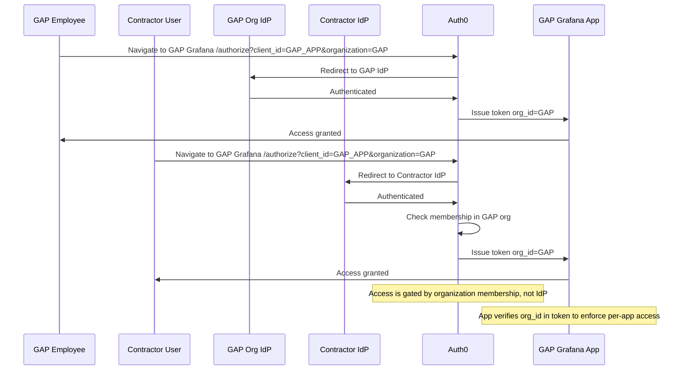

# Auth0 Per-App Organization Scoping Guide

This document explains how to configure **per-app organization scoping** in Auth0, allowing:

- Employees to authenticate via their organization IdP
- Contractors to authenticate via their own IdP
- Access to be restricted to a specific organization's application instance

---

## 1. Core Concept

- **Organizations** control membership, not identity source.
- Access is enforced **at login** by specifying the `organization` parameter in the Auth0 authorize URL.
- Tokens include `org_id` which the app can use for **per-app access control**.

---



## 2. Setup Steps

### Step A — Configure Customer Organization
1. Go to **Auth0 Dashboard → Organizations → Create Organization**.
2. Example: `GAP`.
3. Add the **GAP internal IdP** (e.g., GAP GitHub or Entra ID).

### Step B — Create the Application (Client)
1. Go to **Applications → Applications → Create Application**.
2. Example: `GAP Grafana`.
3. Select application type: Regular Web App (or appropriate SPA).

### Step C — Use Organization in Login URL
- Employees and contractors access the app with:

```
https://YOUR_DOMAIN/authorize?
client_id=GAP_APP_CLIENT_ID
&response_type=code
&scope=openid profile email
&organization=GAP
```


- Auth0 will enforce **organization membership** at login.

### Step D — Add Contractor Users as Members
- Go to **Organizations → GAP → Members**.
- Add contractor users **directly as members** (Management API or Dashboard).
- **Do NOT enable contractor IdPs on GAP org**.
- Contractors can authenticate via their home IdP (global connection).

### Step E — Token & App Validation
- Auth0 includes `org_id` in the ID token/access token.
- App should enforce **tenant-based access** using `org_id`.
- Optionally, check `roles` for RBAC.

---

## 3. Management API Examples

**Add contractor users to organization:**

```http
POST /api/v2/organizations/{ORG_ID}/members
Content-Type: application/json
Authorization: Bearer MGMT_API_TOKEN

{
  "members": ["auth0|employee123", "google-oauth2|contractor456"]
}
```
Login URL for application with organization scoping:

```
https://YOUR_DOMAIN/authorize?
  client_id=GAP_APP_CLIENT_ID
  &response_type=code
  &scope=openid profile email
  &organization=GAP
```

